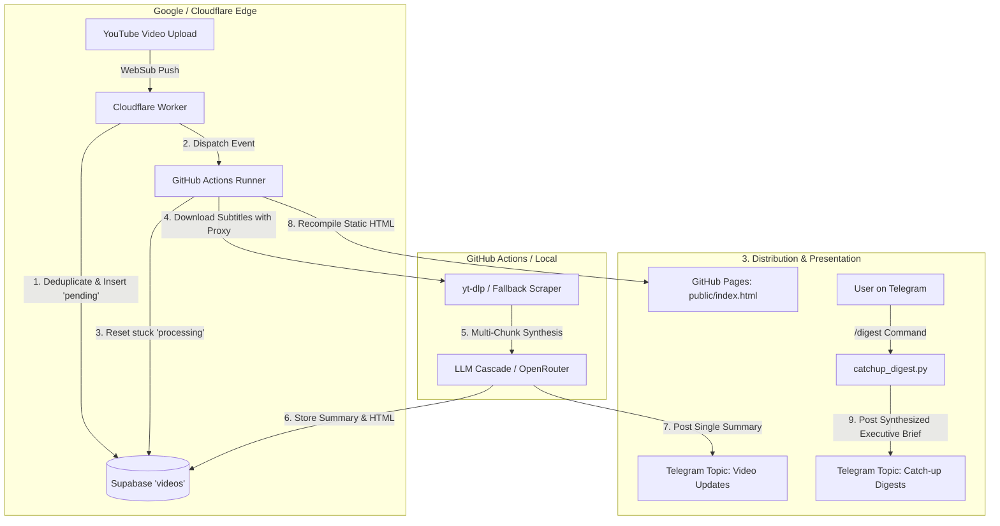

# AGENT.md - AI Engineer Newsletter & Intelligence Pipeline

This document provides a comprehensive technical blueprint, operational guide, and architectural specification for AI agents and engineers working on this codebase.

---

## 1. System Mission & Core Workflows

The system is a 100% serverless, zero-maintenance pipeline that monitors the **AI Engineer YouTube Channel**, analyzes every uploaded talk/video using LLMs, broadcasts technical breakdowns to Telegram, and maintains an interactive static knowledge base deployed to GitHub Pages.

### Primary Data Lifecycles



---

## 2. Codebase Architecture & File Responsibilities

| File | Type | Purpose & Responsibilities |
|---|---|---|
| `main.py` | Python CLI / Orchestrator | Main pipeline entry point. Manages video lifecycle, self-healing status recovery, subtitle extraction, LLM analysis, Telegram publishing, and static site rebuild trigger. |
| `catchup_digest.py` | Python Service | Reads unopened video summaries, executes multi-video cross-synthesis via LLM into an executive briefing, dispatches to Telegram, and manages `user_state.json`. |
| `telegram_bot.py` | Python Module | Telegram Bot API client. Supports HTML chunk splitting, topic routing (`message_thread_id`), polling for commands (`/digest`, `/unread`, `/markread`), and auto-detecting group/topic IDs. |
| `llm_analyzer.py` | Python Module | LLM client supporting OpenRouter and Gemini. Implements exponential backoff, rate-limit retry, Map-Reduce chunking for long transcripts, and fallback models. |
| `transcript_fetcher.py` | Python Module | Extracts transcripts using `yt-dlp` with proxy rotation, public API fallback, and automated subtitle cleanup with timestamps. |
| `ingestor.py` | Python Module | YouTube feed and HTML watch-page fallback scraper when direct API or proxy fails. |
| `generate_static_site.py` | Python Generator | Fetches processed videos from Supabase and renders a searchable, responsive static archive at `public/index.html`. |
| `db.py` | Python Client | Supabase database abstraction layer for querying, inserting, and updating the single-table `videos` schema. |
| `youtube-websub-worker/` | Cloudflare Worker | Edge endpoint receiving Google WebSub push notifications, validating HMAC-SHA1 signatures, inserting `pending` status into Supabase, and triggering GitHub Actions. |
| `.github/workflows/process_videos.yml` | CI/CD Workflow | GitHub Actions configuration running the pipeline upon repository dispatch or daily backup cron. |
| `user_state.json` | JSON State | Tracks `read_video_ids` and `last_digest_at` to distinguish unopened messages from opened messages. |

---

## 3. Environment Variables & Secrets Reference

| Variable | Scope | Description |
|---|---|---|
| `SUPABASE_URL` | Worker, GHA, Local | Supabase project URL (`https://<project-ref>.supabase.co`). |
| `SUPABASE_KEY` | Worker, GHA, Local | Supabase `service_role` key (bypasses RLS). |
| `OPENROUTER_API_KEY` | GHA, Local | OpenRouter API Key for LLM inference (e.g. `Llama 3.3 70B`, `Gemma 4 26B`). |
| `TELEGRAM_BOT_TOKEN` | GHA, Local | Telegram Bot Token from `@BotFather`. |
| `TELEGRAM_CHAT_ID` | GHA, Local | Target Supergroup / Channel ID (e.g., `-1004311421904`). |
| `TELEGRAM_SUMMARY_THREAD_ID` | GHA, Local | Forum Topic ID for individual video updates (e.g., `3`). |
| `TELEGRAM_DIGEST_THREAD_ID` | GHA, Local | Forum Topic ID for executive catch-up digests (e.g., `2`). |
| `GITHUB_TOKEN` | Worker | GitHub Personal Access Token (`repo` / `actions` permissions) for triggering workflow dispatch. |
| `WEBHOOK_SECRET` | Worker | Shared HMAC-SHA1 secret used for WebSub push verification. |
| `YOUTUBE_PROXY` | GHA, Local | Comma-separated HTTP proxy list for `yt-dlp` IP rotation. |
| `SITE_URL` | Local / GHA | Base URL for deployed GitHub Pages static site. |

---

## 4. Telegram Sub-Channels (Forum Topics) Architecture

The bot uses Telegram Forum Supergroups to organize communication cleanly:
* **Chat Type**: Supergroup with `is_forum = True`.
* **Summary Topic (`TELEGRAM_SUMMARY_THREAD_ID`)**: Single-video detailed breakdowns containing timestamped takeaways, architecture notes, and code snippets.
* **Digest Topic (`TELEGRAM_DIGEST_THREAD_ID`)**: High-level executive briefings synthesizing 10–50 unopened videos into thematic patterns and recommendations.

### Telegram Command Handlers
Commands are processed via `telegram_bot.py`:
* `/digest` or `/catchup`: Synthesizes all unopened videos into an executive briefing, delivers it to the Digest Topic, and marks videos as read.
* `/unread` or `/status`: Displays the count of unread videos awaiting review.
* `/markread` or `/clear`: Resets and marks all existing videos as read.
* `/help` or `/start`: Prints command reference.

---

## 5. Database Schema & State Lifecycle

The database uses a single consolidated table: **`videos`**.

```sql
CREATE TABLE videos (
    video_id TEXT PRIMARY KEY,
    title TEXT NOT NULL,
    status TEXT DEFAULT 'pending', -- 'pending' | 'processing' | 'processed' | 'failed'
    model TEXT,                    -- Active model or retry counter (e.g. 'retry_1')
    telegram_summary_text TEXT,    -- Formatted HTML message sent to Telegram
    webpage_detailed_info_text TEXT,-- Long-form HTML content for static site
    created_at TIMESTAMPTZ DEFAULT now()
);
```

### Video Status Transitions
1. `pending`: Inserted by Cloudflare Worker or backfill script.
2. `processing`: Claimed by runner when actively fetching subtitles or running LLM.
3. `processed`: Finished LLM synthesis, Telegram message dispatched, HTML stored.
4. `failed`: Capped after 3 consecutive retry failures. Automatically reset by daily cron after 20 hours.

---

## 6. Self-Healing & Fault-Tolerance Principles

When modifying or extending this pipeline, maintain these core resiliency guarantees:

1. **Deadlock Prevention (`reset_stuck_videos`)**:
   Always run `reset_stuck_videos()` on pipeline boot. If a runner dies mid-execution, orphan `processing` rows are automatically recovered on the next execution.
2. **LLM Cascade & Map-Reduce**:
   Long transcripts (>6,000 words) MUST be chunked and summarized via Map-Reduce to avoid context overflow and rate limits. Always provide fallback models in `llm_analyzer.py`.
3. **Pydantic Flexibility**:
   LLM JSON outputs may occasionally vary field names (e.g. `summary` vs `executive_summary_html`). Ensure Pydantic models use optional fields and getter properties to prevent validation exceptions.
4. **Proxy Auto-Fallback**:
   Direct `yt-dlp` requests from data centers are often blocked with HTTP 429/403. Keep proxy rotation active with fallbacks to public APIs and watch page scraping.

---

## 7. Developer & Agent Operational Commands

### Environment Setup
```bash
# Activate virtual environment
source ./venv/bin/activate

# Install dependencies
pip install -r requirements.txt
```

### Run & Test Pipelines
```bash
# Process all pending videos in database
python main.py

# Process a single specific YouTube video ID
python main.py <VIDEO_ID>

# Generate and send a Catch-Up Digest for unopened videos
python catchup_digest.py

# Detect Telegram group and topic thread IDs automatically
python telegram_bot.py detect

# Send a test message to Telegram
python telegram_bot.py test

# Poll and process pending Telegram commands (/digest, /unread, etc.)
python telegram_bot.py poll

# Rebuild the static site locally
python generate_static_site.py
```

### Cloudflare Worker Management
```bash
cd youtube-websub-worker

# Test worker locally
npx wrangler dev

# Deploy worker to Cloudflare
npx wrangler deploy

# Trigger manual WebSub re-subscription
curl https://youtube-websub-worker.2612brian.workers.dev/subscribe
```
