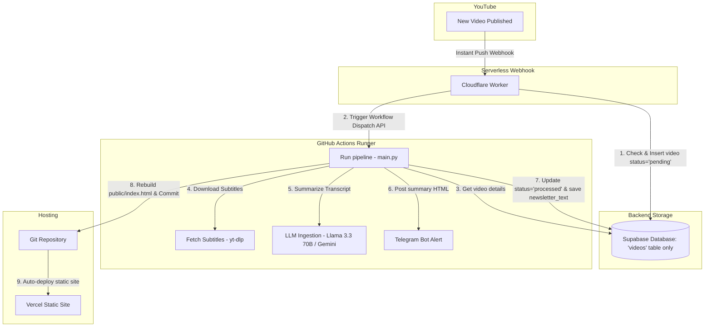

# AI Engineer Newsletter Pipeline

An automated, serverless pipeline that extracts transcripts from new video uploads on the **AI Engineer YouTube Channel**, analyzes them using LLMs (defaulting to Llama 3.3 70B on OpenRouter or direct Google Gemini API), sends detailed technical newsletters to Telegram, and compiles a fast, static HTML digest site deployed automatically to Vercel.

---

## Purpose of the System

The **AI Engineer YouTube Channel** frequently uploads high-value videos detailing new LLM techniques, frameworks, and agent architectures. Keeping up with this content manually and sharing key insights is time-consuming.

This system fully automates the process:
1. **Detects new uploads instantly** (within minutes of publication).
2. **Extracts full transcripts** and parses them into clean text formats.
3. **Generates detailed, technical deep-dive newsletters** sequentially covering every timestamp/section using Llama 3.3 70B or native Gemini.
4. **Pushes alerts immediately to Telegram** so your team or audience is always notified.
5. **Rebuilds a fast, searchable static knowledge hub** hosted on Vercel for archive lookup.

By operating serverlessly, the entire stack runs **completely free** without maintenance overhead or subscription costs.

---

## Architecture Diagram



---

## How the Automation Works (Cloudflare Worker + WebSub)

Instead of running an expensive server 24/7 that repeatedly queries (polls) the YouTube API for new videos (which quickly exhausts daily API quotas and introduces delays), we utilize a native push protocol:

1. **WebSub Webhook**: YouTube proactively sends a push request (webhook) to our Cloudflare Worker the moment a video goes public.
2. **Instant & Serverless**: The Cloudflare Worker is a lightweight endpoint that remains idle and runs only for fractions of a second when pinged, costing nothing.
3. **Lease Auto-Renewal**: Google's WebSub protocol requires lease renewals every few days. The Worker has an automated daily Cron trigger (`0 0 * * *`) that tells Google's Hub: *"Keep sending us new video alerts for the next 5 days."* This background loop runs silently in the background so you never lose the subscription.

---

## Detailed Execution Flow (Under the Hood)

When a new video is published on YouTube, the following sequence occurs automatically:

1. **Webhook Reception & Signature Verification**:
   The Cloudflare Worker receives the XML payload from Google's Hub. It computes an HMAC-SHA1 signature of the body using the `WEBHOOK_SECRET` to verify that the request is genuinely from YouTube.
2. **Deduplication Check**:
   The Worker extracts the `video_id` and pings your Supabase database using a `POST` request with the header `Prefer: resolution=ignore-duplicates`. If the video already exists, it skips triggering the runner (preventing duplicate processing). If it's new, it creates a database row with `status = 'pending'`.
3. **Trigger GitHub Action**:
   The Worker sends a `Repository Dispatch` request to the GitHub API, passing the `video_id` and `title` in the client payload.
4. **Environment Setup & Run**:
   A GitHub Actions virtual machine boots up, checks out your code, installs Python dependencies, and runs:
   ```bash
   python main.py --video_id <VIDEO_ID>
   ```
5. **Transcript Download (`transcript_fetcher.py`)**:
   The script invokes `yt-dlp` to download the English subtitles. It attempts to fetch manually uploaded subtitles first, falling back to auto-generated subtitles if necessary, and formats the output into clean timestamps.
6. **LLM Synthesis & Map-Reduce (`llm_analyzer.py`)**:
   * **Default Model**: Targeted to `meta-llama/llama-3.3-70b-instruct:free` (or direct Google Gemini API if a key is provided).
   * **Dynamic Thresholds**: The pipeline dynamically adjusts token thresholds based on the model in use (e.g. 500k for Gemini, 80k for Llama 3.3).
   * **Map-Reduce Fallback**: If a video is long and exceeds the single-pass threshold:
     * **Map Phase**: Chunk the transcript into smaller pieces, extracting detailed technical notes for each segment.
     * **Reduce Phase**: Synthesize the segment summaries into a single, cohesive, long-form newsletter.
7. **Telegram Broadcast (`telegram_bot.py`)**:
   The generated summary is formatted into HTML and sent directly to your Telegram channel via the Telegram Bot API.
8. **Static Rebuild (`generate_static_site.py`)**:
   The script queries the `processed` videos from the single `videos` table in Supabase, compiles them into a premium, responsive static HTML digest page (`public/index.html`), and commits the changes back to your GitHub repository.
9. **Instant Deployment**:
   Vercel detects the new Git commit to `public/index.html` and redeploys the site automatically.

---

## Database Schema (Single Table)

We simplified the backend to store all data in a single table: **`videos`**.

```sql
CREATE TABLE videos (
    video_id TEXT PRIMARY KEY,
    title TEXT NOT NULL,
    description TEXT,
    upload_date TEXT,
    status TEXT DEFAULT 'pending',
    model TEXT,
    newsletter_text TEXT,
    created_at TIMESTAMPTZ DEFAULT now()
);
```

---

## Verification & Troubleshooting

Here is how you can verify that each part of your pipeline is working:

### 1. Verify the WebSub Subscription
You can check if Google's Hub has successfully registered your Cloudflare Worker:
1. Open this link in your browser (it contains your secure verification secret):
   👉 **[PubSubHubbub Diagnostics Portal](https://pubsubhubbub.appspot.com/subscription-details?hub.callback=https://youtube-websub-worker.2612brian.workers.dev&hub.topic=https://www.youtube.com/xml/feeds/videos.xml?channel_id=UCLKPca3kwwd-B59HNr-_lvA&hub.secret=54117b8f2a3df29c2d79d7f5a03496f8c7e2d9a3)**
2. Verify that **State** says `active` or `verified`.

### 2. Verify Database Ingestion
* When a new video goes live, a row should immediately appear in your Supabase `videos` table with the `status` set to `pending`.

### 3. Verify GitHub Actions Run
* Go to the **Actions** tab of your repository on GitHub.
* You should see a workflow run named **Process YouTube Videos** triggered by `Repository Dispatch` (`new_video_uploaded`).

---

## Setup Status

### ✅ Completed Setup Items

1. **Git Repository decoupling**: De-coupled the project from the Desktop directory into a clean, independent Git repository and pushed it to [GitHub](https://github.com/briannoelkesuma/ai_engineer_newsletter).
2. **Cloudflare Worker Deploy**: Deployed the Worker (`youtube-websub-worker`) to Cloudflare. Live URL: `https://youtube-websub-worker.2612brian.workers.dev`.
3. **Cloudflare Worker Secrets**: Configured and uploaded secrets to Cloudflare (`SUPABASE_URL`, `SUPABASE_KEY`, `GITHUB_TOKEN`, `WEBHOOK_SECRET`).
4. **Subscription Activation**: Activated WebSub handshake.
5. **Database simplification**: Combined `insights` and `videos` into a single `videos` table.
6. **Robust LLM configuration**: Set Llama 3.3 70B as default and implemented Map-Reduce for long transcripts.

### ⏳ Remaining Setup Items

#### Connect Repo to Vercel
1. Go to [Vercel](https://vercel.com) and click **Add New -> Project**.
2. Import the `ai_engineer_newsletter` repository.
3. In the Build and Development Settings, set the build output directory to `public`.
4. Deploy the project.

---

## File Directory Structure

- `youtube-websub-worker/`: The Cloudflare Worker codebase.
  - `src/index.js`: Webhook handler, inserts pending videos to Supabase, dispatches GitHub Action.
  - `wrangler.toml`: Worker configuration, cron scheduler, and static variables.
- `.github/workflows/process_videos.yml`: GitHub Actions automated workflow file.
- `main.py`: Core pipeline manager.
- `ingestor.py`: Fallback scraper logic for channel metadata.
- `transcript_fetcher.py`: Subtitle downloader and parser using `yt-dlp`.
- `llm_analyzer.py`: OpenRouter and Gemini direct analysis client.
- `telegram_bot.py`: Telegram channel alert client.
- `generate_static_site.py`: Static site builder.
- `db.py`: Supabase database client.
- `public/index.html`: Compiled newsletter static page.
- `scratch/`: Utility helper scripts:
  - `recreate_tables.sql`: SQL migration script to wipe and build the single-table schema.
  - `clear_db.py`: Script to quickly wipe database rows for testing.
  - `backfill.py`: Script to ingest and backfill historical videos.
  - `test_single_video.py`: Script to test the pipeline (subtitles + LLM analysis) on a single video ID.