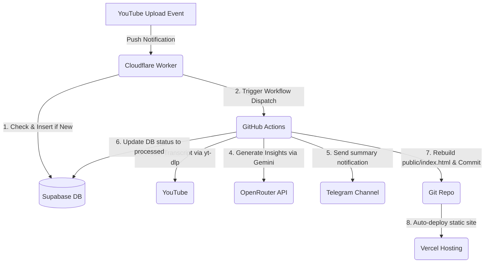

# AI Engineer Newsletter Pipeline

An automated, serverless pipeline that extracts transcripts from new video uploads on the **AI Engineer YouTube Channel**, analyzes them using LLMs (via OpenRouter), sends summarized insights to a Telegram channel, and compiles a fast, static HTML digest site deployed automatically to Vercel.

---

## Architecture Diagram

---

## Features

- **Zero-Cost Operation**: Utilizes Cloudflare Worker free tier, GitHub Actions free minutes, Vercel static hosting, and Supabase free tier database.
- **Instant Event Trigger**: Avoids polling limits or API key quotas by using YouTube's native WebSub (PubSubHubbub) webhook protocol.
- **Self-Healing Cron Fallback**: Includes a daily backup schedule on GitHub Actions to process any missed webhooks or failed runs.
- **Fast-Path Optimization**: When triggered by a webhook, the pipeline executes specifically for the new video ID, bypassing expensive channel scrapings.
- **Automatic Subscriptions**: The worker runs a daily Cron trigger to automatically renew the Google WebSub 5-day lease forever.

---

## Setup Status

### ✅ Completed Setup Items

1. **Git Repository decoupling**: De-coupled the project from the Desktop directory into a clean, independent Git repository and pushed it to [GitHub](https://github.com/briannoelkesuma/ai_engineer_newsletter).
2. **Cloudflare Worker Deploy**: Deployed the Worker (`youtube-websub-worker`) to Cloudflare. Live URL: `https://youtube-websub-worker.2612brian.workers.dev`.
3. **Cloudflare Worker Secrets**: Configured and uploaded the following secrets to Cloudflare:
   - `SUPABASE_URL`
   - `SUPABASE_KEY`
   - `GITHUB_TOKEN` (GitHub Personal Access Token)
   - `WEBHOOK_SECRET` (Cryptographic verification key)
4. **Subscription Activation**: Triggered the initial subscription handshake request with Google's WebSub Hub and verified activation.
5. **Pipeline Portability**: Optimized the python scripts (`main.py` and `transcript_fetcher.py`) to run dynamically on any environment (including the GitHub Action runner).

### ⏳ Remaining Setup Items

To complete the pipeline setup, you must configure the following remaining items:

#### 1. Add GitHub Repository Secrets
The GitHub Actions workflow runs the Python scripts and needs access to your API keys. Go to **Settings -> Secrets and variables -> Actions** in your GitHub repository and add the following 5 secrets:

| Secret Name | Description / Value |
| :--- | :--- |
| `SUPABASE_URL` | Your Supabase project REST API endpoint |
| `SUPABASE_KEY` | Your Supabase service role or anon key |
| `OPENROUTER_API_KEY` | Your OpenRouter API Key for Gemini flash |
| `TELEGRAM_BOT_TOKEN` | Token for the Telegram bot posting updates |
| `TELEGRAM_CHAT_ID` | Telegram chat/channel ID where updates are posted |

#### 2. Connect Repo to Vercel
To make your static site live:
1. Go to [Vercel](https://vercel.com) and click **Add New -> Project**.
2. Import the `ai_engineer_newsletter` repository.
3. In the Build and Development Settings, set the **Root Directory** or build output directory to `public` (so it serves `public/index.html` as the homepage).
4. Deploy the project. Vercel will automatically redeploy the site on every automatic commit pushed by the GitHub Actions runner.

---

## File Directory Structure

- `youtube-websub-worker/`: The Cloudflare Worker codebase.
  - `src/index.js`: Handles webhook challenge verify, inserts pending videos to Supabase, and dispatches GitHub Action.
  - `wrangler.toml`: Worker configuration, cron scheduler, and static variables.
- `.github/workflows/process_videos.yml`: GitHub Actions automated workflow file.
- `main.py`: Core pipeline manager.
- `ingestor.py`: Fallback scraper logic for channel metadata.
- `transcript_fetcher.py`: Subtitle downloader and parser using `yt-dlp`.
- `llm_analyzer.py`: OpenRouter analysis handler.
- `telegram_bot.py`: Telegram channel alert client.
- `generate_static_site.py`: Static site builder.
- `db.py`: Supabase database client.
- `public/index.html`: Compiled newsletter static page.