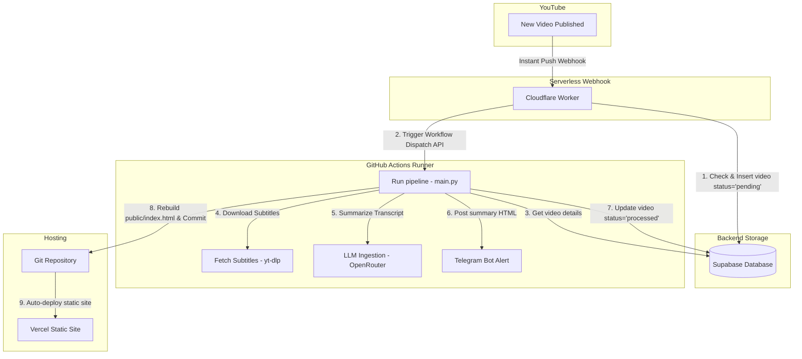

# AI Engineer Newsletter Pipeline

An automated, serverless pipeline that extracts transcripts from new video uploads on the **AI Engineer YouTube Channel**, analyzes them using LLMs (via OpenRouter), sends summarized insights to a Telegram channel, and compiles a fast, static HTML digest site deployed automatically to Vercel.

---

## Purpose of the System

The **AI Engineer YouTube Channel** frequently uploads high-value videos detailing new LLM techniques, frameworks, and agent architectures. Keeping up with this content manually and sharing key insights is time-consuming.

This system fully automates the process:
1. **Detects new uploads instantly** (within minutes of publication).
2. **Generates concise summaries** categorized by companies, themes, and key takeaways using LLMs.
3. **Pushes alerts immediately to Telegram** so your team or audience is always notified.
4. **Rebuilds a fast, searchable static knowledge hub** hosted on Vercel for archive lookup.

By operating serverlessly, the entire stack runs **completely free** without maintenance overhead or subscription costs.

---

## Architecture Diagram

---

## How the Automation Works (Cloudflare Worker + WebSub)

Instead of running an expensive server 24/7 that repeatedly queries (polls) the YouTube API for new videos (which quickly exhausts daily API quotas and introduces delays), we utilize a native push protocol:

1. **WebSub Webhook**: YouTube proactively sends a push request (webhook) to our Cloudflare Worker the moment a video goes public.
2. **Instant & Serverless**: The Cloudflare Worker is a lightweight endpoint that remains idle and runs only for fractions of a second when pinged, costing nothing.
3. **Lease Auto-Renewal**: Google's WebSub protocol requires lease renewals every few days. The Worker has an automated daily Cron trigger (`0 0 * * *`) that tells Google's Hub: *"Keep sending us new video alerts for the next 5 days."* This background loop runs silently in the background so you never lose the subscription.

---

## Verification & Troubleshooting

Here is how you can verify that each part of your pipeline is working:

### 1. Verify the WebSub Subscription
You can check if Google's Hub has successfully registered your Cloudflare Worker:
1. Open this link in your browser:
   👉 **[PubSubHubbub Diagnostics Portal](https://pubsubhubbub.appspot.com/subscription-details?hub.callback=https://youtube-websub-worker.2612brian.workers.dev&hub.topic=https://www.youtube.com/xml/feeds/videos.xml?channel_id=UCLKPca3kwwd-B59HNr-_lvA)**
2. Verify that **State** says `active`.
3. Check the **Last Verification** date and verify that the callback points to your worker.

### 2. Verify Database Ingestion
* When a new video goes live, a row should immediately appear in your Supabase `videos` table with the `status` set to `pending`.

### 3. Verify GitHub Actions Run
* Go to the **Actions** tab of your repository on GitHub.
* You should see a workflow run named **Process YouTube Videos** triggered by `Repository Dispatch` (`new_video_uploaded`).
* Click the run to watch progress, check logs, and verify that the static file gets auto-committed back to git.

---

## Setup Status

### ✅ Completed Setup Items

1. **Git Repository decoupling**: De-coupled the project from the Desktop directory into a clean, independent Git repository and pushed it to [GitHub](https://github.com/briannoelkesuma/ai_engineer_newsletter).
2. **Cloudflare Worker Deploy**: Deployed the Worker (`youtube-websub-worker`) to Cloudflare. Live URL: `https://youtube-websub-worker.2612brian.workers.dev`.
3. **Cloudflare Worker Secrets**: Configured and uploaded the following secrets to Cloudflare:
   - `SUPABASE_URL`
   - `SUPABASE_KEY`
   - `GITHUB_TOKEN` (GitHub Personal Access Token)
   - `WEBHOOK_SECRET` (Cryptographic verification key)
4. **Subscription Activation**: Triggered the initial subscription handshake request with Google's WebSub Hub and verified activation.
5. **Pipeline Portability**: Optimized the python scripts (`main.py` and `transcript_fetcher.py`) to run dynamically on any environment.
6. **GitHub Actions Secrets**: Configured `SUPABASE_URL`, `SUPABASE_KEY`, `OPENROUTER_API_KEY`, `TELEGRAM_BOT_TOKEN`, and `TELEGRAM_CHAT_ID` under GitHub Action Secrets.

### ⏳ Remaining Setup Items

#### Connect Repo to Vercel
To make your static site live:
1. Go to [Vercel](https://vercel.com) and click **Add New -> Project**.
2. Import the `ai_engineer_newsletter` repository.
3. In the Build and Development Settings, set the **Root Directory** or build output directory to `public` (so it serves `public/index.html` as the homepage).
4. Deploy the project. Vercel will automatically redeploy the site on every automatic commit pushed by the GitHub Actions runner.

---

## File Directory Structure

- `youtube-websub-worker/`: The Cloudflare Worker codebase.
  - `src/index.js`: Handles webhook challenge verify, inserts pending videos to Supabase, and dispatches GitHub Action.
  - `wrangler.toml`: Worker configuration, cron scheduler, and static variables.
- `.github/workflows/process_videos.yml`: GitHub Actions automated workflow file.
- `main.py`: Core pipeline manager.
- `ingestor.py`: Fallback scraper logic for channel metadata.
- `transcript_fetcher.py`: Subtitle downloader and parser using `yt-dlp`.
- `llm_analyzer.py`: OpenRouter analysis handler.
- `telegram_bot.py`: Telegram channel alert client.
- `generate_static_site.py`: Static site builder.
- `db.py`: Supabase database client.
- `public/index.html`: Compiled newsletter static page.