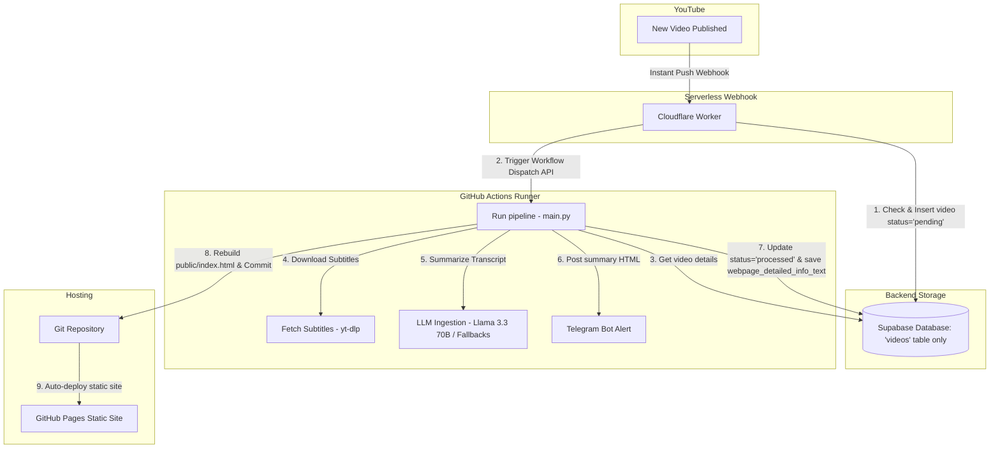

# AI Engineer YouTube Newsletter Pipeline

An automated, serverless pipeline that extracts transcripts from new video uploads on the **AI Engineer YouTube Channel**, analyzes them using LLMs (defaulting to Llama 3.3 70B on OpenRouter with cascading fallbacks), sends detailed technical newsletters to Telegram, and compiles a fast, static HTML digest site deployed automatically to **GitHub Pages**.

---

## Purpose of the System

The **AI Engineer YouTube Channel** frequently uploads high-value videos detailing new LLM techniques, frameworks, and agent architectures. Keeping up with this content manually and sharing key insights is time-consuming.

This system fully automates the process:
1. **Detects new uploads instantly** (within minutes of publication).
2. **Extracts full transcripts** and parses them into clean text formats.
3. **Generates detailed, technical deep-dive newsletters** sequentially covering every timestamp/section using Llama 3.3 70B or other fallback LLMs.
4. **Pushes alerts immediately to Telegram** so your team or audience is always notified.
5. **Rebuilds a fast, searchable static knowledge hub** hosted on **GitHub Pages** for archive lookup.

By operating serverlessly, the entire stack runs **completely free** without maintenance overhead or subscription costs.

---

## Architecture Diagram



---

## Inherent Pipeline Resiliency & Fault-Tolerance

To ensure the system works reliably while you sleep, several robust self-healing and error-recovery mechanisms are built directly into the core code:

### 1. Self-Healing Startup (`reset_stuck_videos`)
If the GitHub Actions runner crashes, runs out of memory, gets cancelled, or times out while processing a video, that video could get locked in a `'processing'` state. 
On every new startup, the pipeline automatically detects and resets all `'processing'` status videos back to `'pending'`, guaranteeing they are automatically rescued on the next run.

### 2. Cascading LLM Fallbacks & Exponential Backoff
To protect against OpenRouter rate limits (HTTP `429`) or temporary model outages:
* The LLM caller uses a **retrying backoff loop** (exponential backoff starting at 5s up to 30s) for 3 consecutive attempts on the default model (`Llama 3.3 70B`).
* If the default model continues to fail, the pipeline automatically cascades through preconfigured fallback models (such as `Google Gemma-4 31B`) until it successfully gets a response.

### 3. Capped Retry Budgets (Preventing Infinite Loops)
If an error is persistent (e.g. invalid transcript file, model input size limit reached), retrying indefinitely would exhaust API keys and run up excessive GitHub Actions minutes. 
* The system tracks attempts in the database (`retry_1`, `retry_2`, `retry_3` stored temporarily in the `model` column).
* After 3 failures within a short period, it changes the video status to `'failed'` to pause processing.

### 4. Daily Failed Retry Reset (`reset_failed_videos_for_daily_retry`)
Failed videos are not abandoned forever. During the daily cron check, the pipeline scans for any videos marked as `'failed'` that were created **more than 20 hours ago**. It automatically resets their status back to `'pending'` and clears the retry attempts. This ensures that transient api outages or day-limit quota resets are handled automatically the next morning.

### 5. Outbound YouTube Proxy Rotation
To prevent YouTube from blocking the runner's IP address when extracting transcripts:
* The system randomly rotates requests through a pool of proxies defined in `YOUTUBE_PROXY`.
* If all proxies are blocked, the script falls back to scraping metadata from the public watch page and pulls transcripts via public CDN APIs as a backstop.

---

## How the Automation Works (Cloudflare Worker + WebSub)

Instead of running an expensive server 24/7 that repeatedly queries (polls) the YouTube API for new videos (which quickly exhausts daily API quotas and introduces delays), we utilize a native push protocol:

1. **WebSub Webhook**: YouTube proactively sends a push request (webhook) to our Cloudflare Worker the moment a video goes public.
2. **Instant & Serverless**: The Cloudflare Worker is a lightweight endpoint that remains idle and runs only for fractions of a second when pinged, costing nothing.
3. **Lease Auto-Renewal**: Google's WebSub protocol requires lease renewals every few days. The Worker has an automated daily Cron trigger (`0 0 * * *`) that tells Google's Hub: *"Keep sending us new video alerts for the next 5 days."* This background loop runs silently in the background so you never lose the subscription.

---

## Detailed Execution Flow (Under the Hood)

When a new video is published on YouTube, the following sequence occurs automatically:

1. **Webhook Reception & Signature Verification**:
   The Cloudflare Worker receives the XML payload from Google's Hub. It computes an HMAC-SHA1 signature of the body using the `WEBHOOK_SECRET` to verify that the request is genuinely from YouTube.
2. **Deduplication Check**:
   The Worker extracts the `video_id` and pings your Supabase database using a `POST` request. If the video already exists, it skips triggering the runner. If it's new, it creates a database row with `status = 'pending'`.
3. **Trigger GitHub Action**:
   The Worker sends a `Repository Dispatch` request to the GitHub API, passing the `video_id` and `title` in the client payload.
4. **Environment Setup & Run**:
   A GitHub Actions virtual machine boots up, checks out your code, installs Python dependencies, and runs the ingestion script.
5. **Transcript Download (`transcript_fetcher.py`)**:
   The script invokes `yt-dlp` with proxy rotation to download subtitles, formatting them with clean timestamps.
6. **LLM Synthesis & Map-Reduce (`llm_analyzer.py`)**:
   Processes the transcript. If the transcript is very long, it uses a Map-Reduce approach (summarizing chunks and then reducing them) to remain within model limits.
7. **Telegram Broadcast (`telegram_bot.py`)**:
   The generated summary is formatted into HTML and sent directly to your Telegram channel.
8. **Static Rebuild (`generate_static_site.py`)**:
   The script queries the `processed` videos from Supabase, compiles them into a premium, responsive static HTML digest page (`public/index.html`), and commits the changes back to your GitHub repository.
9. **Instant Deployment**:
   GitHub Pages automatically detects changes to the repository and deploys the new static site.

---

## Database Schema (Single Table)

We simplified the database to store all data in a single table: **`videos`**.

```sql
CREATE TABLE videos (
    video_id TEXT PRIMARY KEY,
    title TEXT NOT NULL,
    status TEXT DEFAULT 'pending',
    model TEXT,
    telegram_summary_text TEXT,
    webpage_detailed_info_text TEXT,
    created_at TIMESTAMPTZ DEFAULT now()
);
```

---

## YouTube Proxy Implementation (IP Rotation)

To bypass YouTube's strict rate limits and IP bot detection (which frequently blocks standard Cloudflare/GitHub Actions runner IPs), the pipeline implements a robust outbound proxy rotation mechanism:
1. **Multi-Proxy Support**: Reads a list of comma-separated proxy endpoints from the `YOUTUBE_PROXY` environment variable.
2. **Randomized Rotation**: On every request made by `yt-dlp` (both metadata extraction and subtitle downloads), the runner randomly selects an active proxy from this list.
3. **Graceful Fallbacks**: In the event that YouTube blocks the proxy list or requests fail, the pipeline automatically falls back to:
   * Public API transcript retrieval (`youtube-transcript.ai`).
   * Fallback scraping of metadata directly from public YouTube HTML watch pages.

---

## Verification & Troubleshooting

Here is how you can verify that each part of your pipeline is working:

### 1. Verify the WebSub Subscription
You can check if Google's Hub has successfully registered your Cloudflare Worker:
1. Open this link in your browser (it contains your secure verification secret):
   👉 **[PubSubHubbub Diagnostics Portal](https://pubsubhubbub.appspot.com/subscription-details?hub.callback=https://youtube-websub-worker.2612brian.workers.dev&hub.topic=https://www.youtube.com/xml/feeds/videos.xml?channel_id=UCLKPca3kwwd-B59HNr-_lvA&hub.secret=54117b8f2a3df29c2d79d7f5a03496f8c7e2d9a3)**
2. Verify that **State** says `active` or `verified`.

### 2. Verify Database Ingestion
* When a new video goes live, a row should immediately appear in your Supabase `videos` table with the `status` set to `pending`.

### 3. Verify GitHub Actions Run
* Go to the **Actions** tab of your repository on GitHub.
* You should see a workflow run named **Process YouTube Videos** triggered by `Repository Dispatch` (`new_video_uploaded`).

---

## Setup Status

### ✅ Completed Setup Items

1. **Git Repository decoupling**: De-coupled the project into a clean, independent Git repository and pushed it to [GitHub](https://github.com/briannoelkesuma/ai_engineer_newsletter).
2. **Cloudflare Worker Deploy**: Deployed the Worker (`youtube-websub-worker`) to Cloudflare. Live URL: `https://youtube-websub-worker.2612brian.workers.dev`.
3. **Cloudflare Worker Secrets**: Configured and uploaded secrets to Cloudflare (`SUPABASE_URL`, `SUPABASE_KEY`, `GITHUB_TOKEN`, `WEBHOOK_SECRET`).
4. **Subscription Activation**: Activated WebSub handshake.
5. **Database simplification**: Combined `insights` and `videos` into a single `videos` table.
6. **Robust LLM configuration**: Set Llama 3.3 70B as default and implemented Map-Reduce for long transcripts.
7. **GitHub Pages Connection**: Configured GitHub Pages to host the build from the `public` directory, enabling automated static hosting.

---

## File Directory Structure

- `youtube-websub-worker/`: The Cloudflare Worker codebase.
  - `src/index.js`: Webhook handler, inserts pending videos to Supabase, dispatches GitHub Action.
  - `wrangler.toml`: Worker configuration, cron scheduler, and static variables.
- `.github/workflows/process_videos.yml`: GitHub Actions automated workflow file.
- `main.py`: Core pipeline manager.
- `ingestor.py`: Fallback scraper logic for channel metadata.
- `transcript_fetcher.py`: Subtitle downloader and parser using `yt-dlp`.
- `llm_analyzer.py`: OpenRouter and Gemini direct analysis client.
- `telegram_bot.py`: Telegram channel alert client.
- `generate_static_site.py`: Static site builder.
- `db.py`: Supabase database client.
- `public/index.html`: Compiled newsletter static page.
- `scratch/`: Utility helper scripts:
  - `recreate_tables.sql`: SQL migration script to wipe and build the single-table schema.
  - `clear_db.py`: Script to quickly wipe database rows for testing.
  - `backfill.py`: Script to ingest and backfill historical videos.
  - `test_single_video.py`: Script to test the pipeline (subtitles + LLM analysis) on a single video ID.